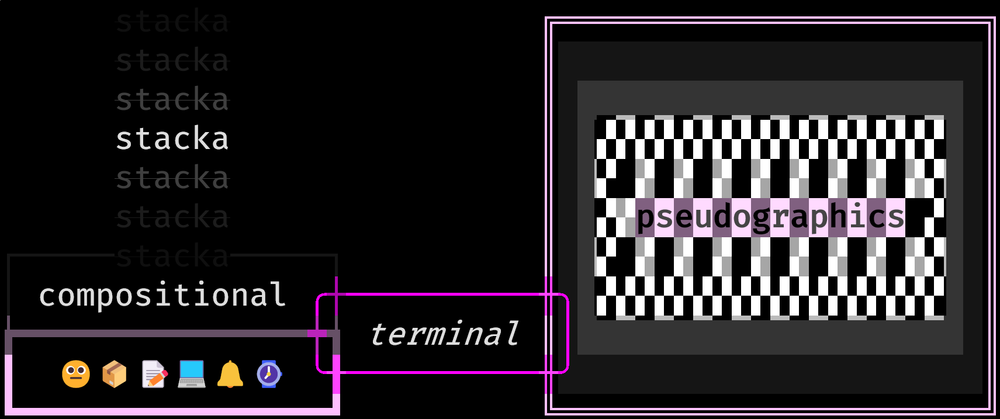
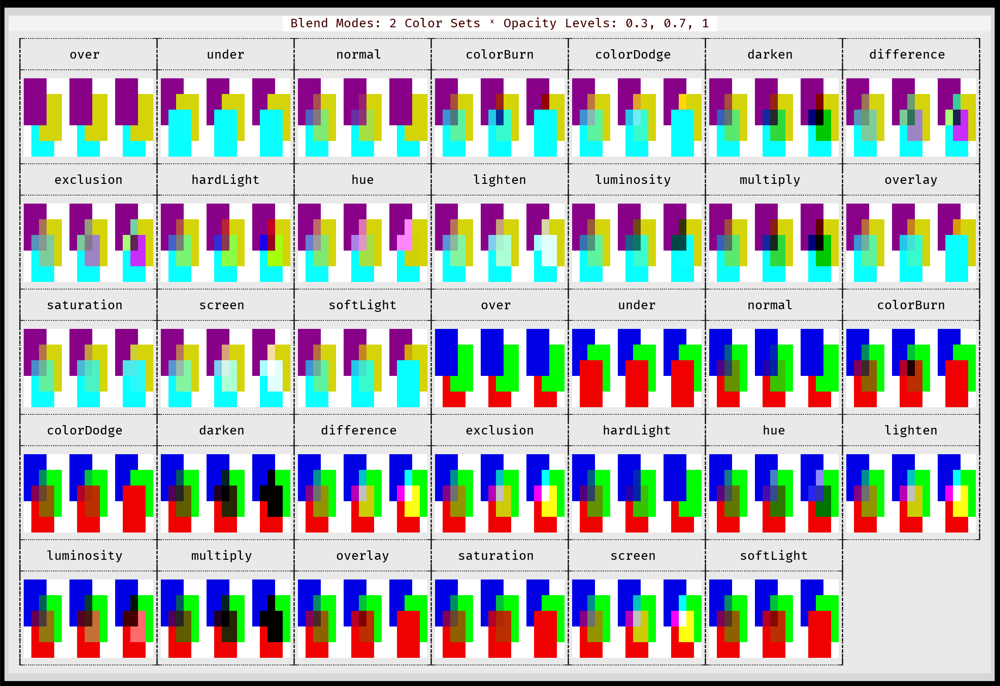
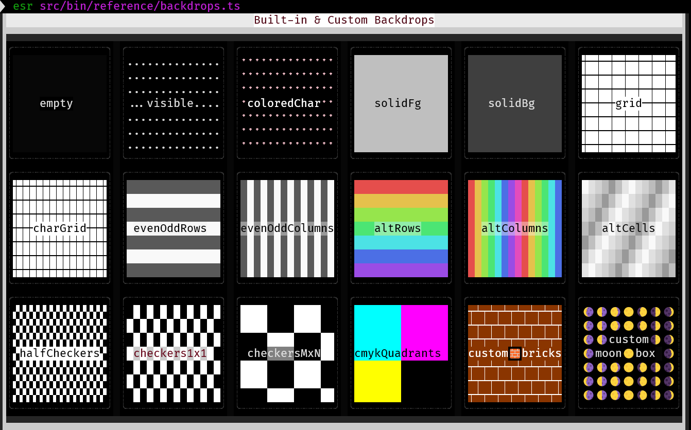
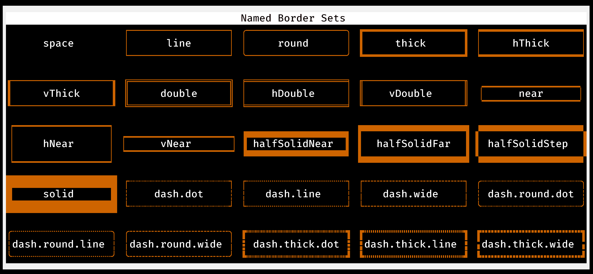
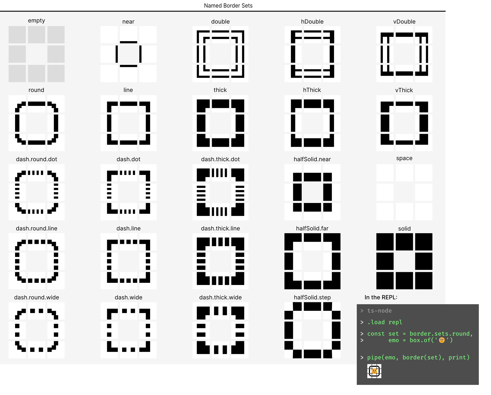
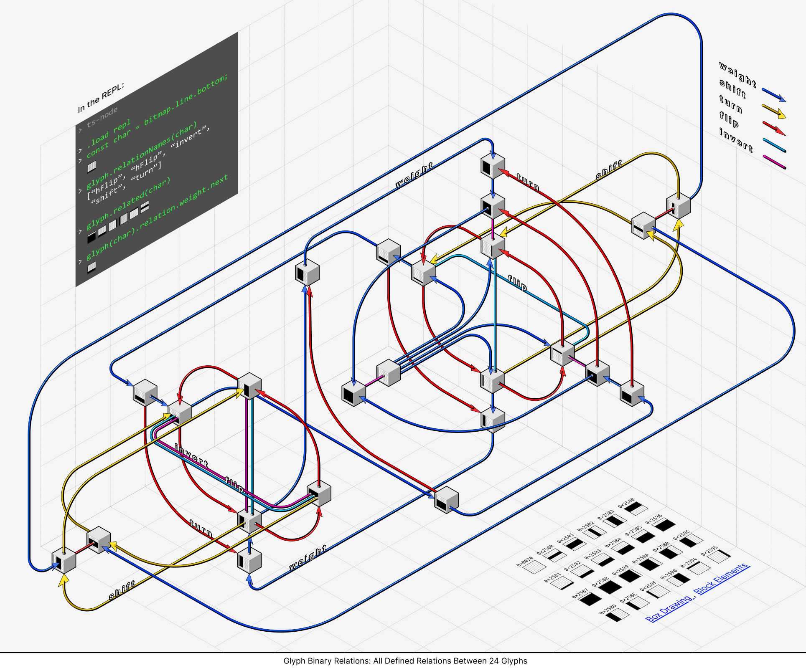
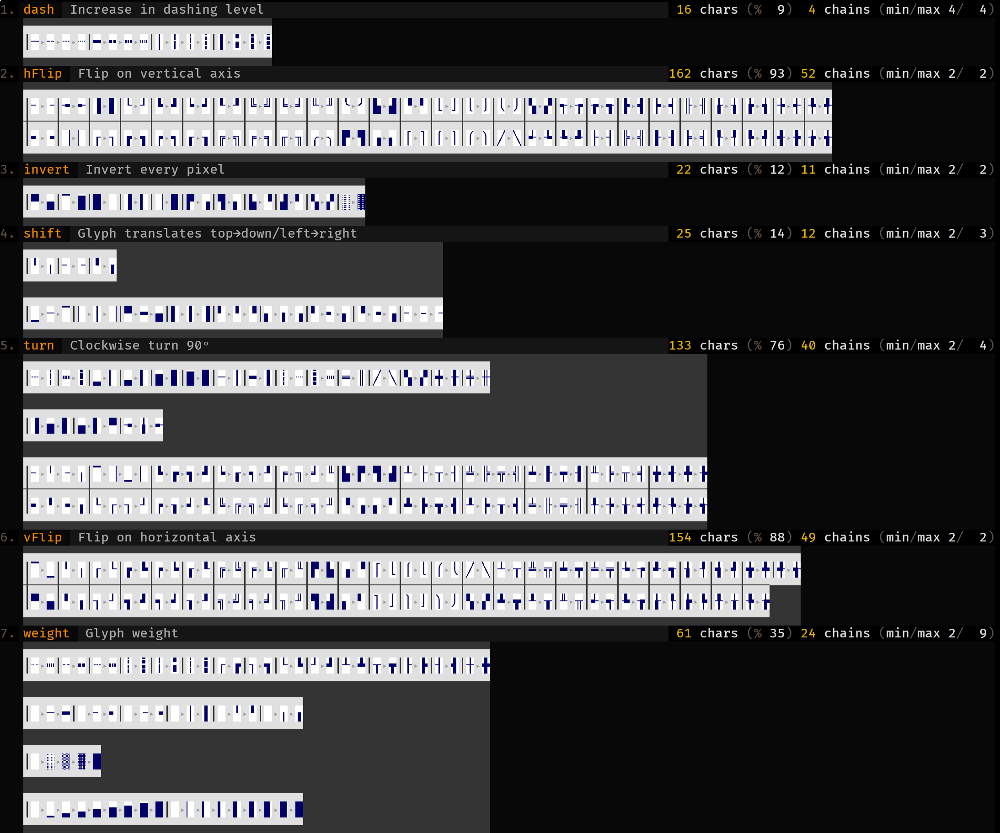
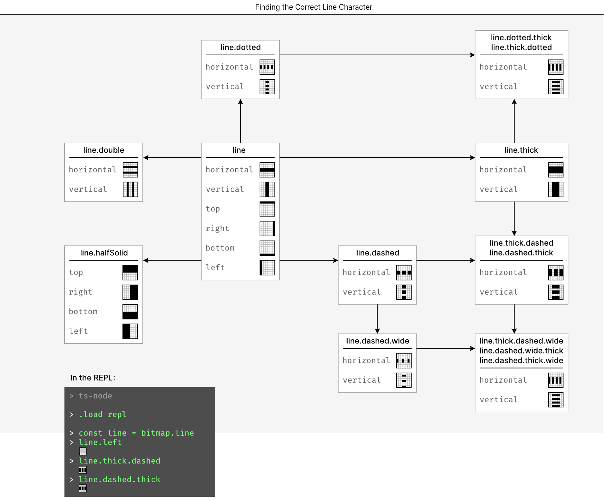
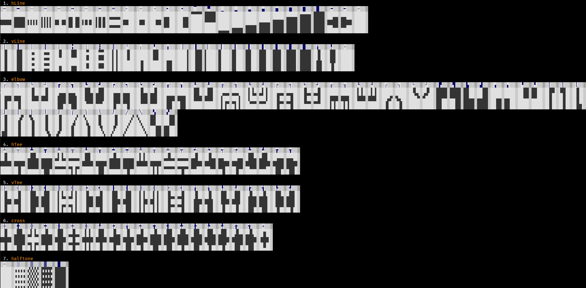

# stacka - Compositional Terminal Pseudographics

Draw styled boxes that naturally compose into complex tables and layouts.

# Introduction

Creating terminal pseudographics by pasting strings is hard. While string are
highly composable things, they are not so in any way that makes sense for 2D
graphics.

Why are strings difficult to compose into nice terminal output?

### Not an abstraction for 2D space

You can prepend to a string, and you can append to it. Translating that into 2D
requires non-trivial computation

### Non-local knowledge required

For example, terminal width is required for correct word-wrapping.

### Cannot stack one string on top of each other

Graphics often requires _stacking_ figures on top of one another, for example
for masking, mixing and blending. Strings do not stack easily:

1. _No “empty” character_ - the `space  ` character is just another string, and
no more transparent that the unicode `FULL BLOCK` character `█`. Stacking
where the top layer always hides the bottom is not very useful
2. _Glyph stacking is difficult_ - sometimes stacking glyphs is possible in the
terminal, for example stacking `│` and `─` to get the cross character `┼`.
It is too hard to find and use such opportunities.

`stacka` is nothing but a set of Typescript types and functions to fix the
issues listed above:

1. **Layout Support** A 2D ANSI and wide-character aware grid that is populated by:
    1. `Block`s are just a set of positioned characters
    1. `Block`s can be composed in various ways: above/below/left of/right
    of/on top and under each other
1. **Compositing Support** `Blocks` have an opacity, zOrder, and a
[CSS color blend mode](https://developer.mozilla.org/en-US/docs/Web/CSS/mix-blend-mode).
`space` characters are treated as transparent, and there is a `None` cell
type which is even more transparent. If stacked glyphs belong to one of the
[6,566 supported glyph merges](doc/all-glyph-combinations.txt), the result
will be the combined glyph. For example a vertical line (`│`) placed on top
of a horizontal one (`─`), will be composited into the cross character
(`┼`).

The goal is to allow you to harness the full, though severely limited , potential of the terminal, without the icky issues. [Creating terminal graphics](src/bin/eg/8-logo.ts) like the picture below should not be much more difficult than working with strings:



## Status and Roadmap

Features are well tested, but API is still changing. Focus in now on documentation + performance.

## Quick Start

### Building and Painting Boxes

`box.of` will create a box from a string, split it by newlines to create
multiple lines, and parse any ANSI styles or wide characters found in the given
box content.

`box.asStrings` will return a list of rows for you to print, or use `box.print`
to output the box directly to `stdout`:

```ts
import { box } from 'stacka';

const helloBox = box.of('Hello World');
box.print(helloBox);
```

### Placing Boxes

There are many other way to create boxes and to render them, but for the
quickstart most interesting are the functions that create boxes from other
boxes, for example, for layout.

`box.leftOf` will layout a pair of boxes with the first on the left and add them to a new box:

```ts
const doubleHello = box.leftOf(helloBox)(helloBox);
box.print(doubleHello);
```

There are 48 other binary placement combinators, and for each a `cat` version
for placement of N boxes. For boxes that need to be in a very specific place,
setting static positions using the provided lenses and placing children
inside a `box.branch` might be a better choice. The function `box.branch`
does no layout on the given boxes, unlike `box.leftOf` we used earlier.

```ts
const helloBox = box.of('HelloWorld');
const leftHello = box.top.set(10)(helloBox);
const rightHello = box.left.set(10)(helloBox);
const doubleHello = box.branch([leftHello,rightHello])
box.print(doubleHello);
```

Note that by default boxes, both leaves and composites, are sized to their
content. If you need to size to the parent box, look into `boxes.flow`.
`boxes.win.flow`, for example will fill to the entire terminal width.

There are many other lenses like `box.top`  and `box.left` used above, for
getting, setting and modding box properties, and you can always set everything
using the `box` constructor.

### Borders

Add a line border with:

```ts
import { box, border } from 'stacka';
const borderedHello = border.line(helloBox);
```

This returns a new box, exactly like the `helloBox`, except it will be
surrounded with a thin line border. There are many other border sets available,
and combinators for masking and combining borders.

Borders have other features to make them more easily composable with the other
boxes: they nest nicely, and assuming a box drawing character exists for this
merge, they seamlessly stack on top of each other.

For example a horizontal border crossing on a vertical one will create a cross
cell. All of the 6,566 possible stacks of unicode box drawing characters are
supported. This allows you to build complex tables with spans and styles
without worrying about how the borders will stack and connect.

To enable merging inside a box, set its `blend` to one of the available blend
modes.

```ts
const blendingBox = box.blend.set('hue')(helloBox);
```
By default this is `combineOver` which merges glyphs but not styles. You can also set z-order and alpha value on boxes for more accurate stacking.

### Backdrops

Boxes have an optional backdrop, modeled after the desktop screen background:
you can set it to stretch, center, or repeat so that it will adapt to your box
size. It will serve as a background for your box, blending with your content
from below.

This makes it easy to create grids, gradients, and patterns as box backgrounds.

### Styling Boxes

#### Styling Box Content

`box` functions that take in box content will always parse ANSI styles, so you
may use any ANSI color library to create styled box content.

#### Styling Boxes Borders, and Backdrops

You use box lenses and helper functions to work with box styles.

Every glyph in the border definition has an associated ANSI style. You can use
the border lenses to get/set/mod them.

There are also functions like `setFg`, `setBg`, `setOpacity` for setting style
of the entire border, and versions of these to change only specific parts at a
some border direction.

Backdrops are implemented using boxes as well, and they have the same lenses
and functions as well.

Wide characters, for example the smiley emojis, can be used in any place that
takes strings, but be advised they do not stack very well because they require
rows to be aligned, at least for a part of the row, or they can break stacking
of narrow characters on same row. See source code for example.

### Compositing

Compositing describes the computation required to stack layers of cells on top of each another. The layers are merged to produce a single layer.

This happens, for example, when merging borders using the `snug` placement combinators, or when stacking box content over its `Backdrop`. 

Such an operation needs to determine the result:

1. Foreground and background colors
1. ANSI decorations, for example: **bold** `⊕` _italic_ = _**bold italic**_
1. Glyph - if glyph combination is available

There are _four_ factors that determine this result:

1. How empty is the cell? If the cell is of type `None`, or is populated by a space character, it is considered empty. Empty cells are completely transparent.
1. Cell zOrder: higher zOrder will appear above lower. By default the order of adding boxes to a parent sets the zOrder
1. The foreground/background color and opacity: low opacity on the foreground color, for example, would let lower layers foreground colors appear more clearly
1. The blend mode of the parent: besides standard CSS blends there are also:
    1. `over` and `under` - no glyph or style blending
    2. `combineOver` and `combineUnder` - only glyph blending. `combineOver` is the default blend mode
  
You can change box zOrder with the `box.zOrder` lens. You can quickly increase zOrder with `box.incZOrder`.

`box.setFgOpacity` and `box.setBgOpacity` can be used to set the opacity of an entire box.

`box.blend` is a lens on the box color blend mode. Note it is used when compositing its children and not the box itself. For compositing the box itself, we use the parent box blend mode.

The [blends.ts](src/bin/reference/blends.ts) reference script will show all
blend modes and their effects. Screenshot:



The stacking operation is associative only on rows when there are no wide characters.

### Glyphs

You import `glyph` from `stacka` with:

```ts
import {glyph} from 'stacka`;
```

You will find there functions for working with Unicode box drawing characters.

`glyph` builds binary relations between the glyphs according to criteria like
`weight`: this glyph is the heavier version of that, `inverse`: this glyph is
that glyph with all bits inverted, and some others like `turn` and `flip`.

This could help you navigate between glyphs, for example by asking for the
heavier version of a glyph you already have, or even do this for entire
borders, E.g. asking for a heavier version of a border.

To help humans navigate this, a diagram `doc/relations.svg` shows the relations
modeled, and a script `next-glyph` shows the relation as a tree from a single
glyph.

## Placement Combinators

12 binary combinators per direction. Each has an N-ary version with a prefix of
`cat`. For example, the N-ary analogue of `snugLeftOf` is `catSnugLeftOf`.

```txt

───────────────────────────────────────────────────────────────────
    FUNCTION       PLACE  ALIGN  GAP           NOMENCLATURE
───────────────────────────────────────────────────────────────────
 1. above             ↑     ←    0               above
 2. aboveCenter       ↑     ↔    0               above   center
 3. aboveRight        ↑     →    0               above   right
 4. snugAbove         ↑     ←   -1    snug       above
 5. snugAboveCenter   ↑     ↔   -1    snug       above   center
 6. snugAboveRight    ↑     →   -1    snug       above   right
 7. aboveGap          ↑     ←    •               above          gap
 8. aboveCenterGap    ↑     ↔    •               above   center gap
 9. aboveRightGap     ↑     →    •               above   right  gap
10. alignAbove        ↑     •    0         align above
11. snugAlignAbove    ↑     •   -1    snug align above
12. alignAboveGap     ↑     •    •         align above   gap
13. below             ↓     ←    0               below
14. belowCenter       ↓     ↔    0               below   center
15. belowRight        ↓     →    0               below   right
16. snugBelow         ↓     ←   -1    snug       below
17. snugBelowCenter   ↓     ↔   -1    snug       below   center
18. snugBelowRight    ↓     →   -1    snug       below   right
19. belowGap          ↓     ←    •               below          gap
20. belowCenterGap    ↓     ↔    •               below   center gap
21. belowRightGap     ↓     →    •               below   right  gap
22. alignBelow        ↓     •    0         align below
23. snugAlignBelow    ↓     •   -1    snug align below
24. alignBelowGap     ↓     •    •         align below   gap
25. leftOfTop         ←     ↑    0               leftOf  top
26. leftOfMiddle      ←     ↔    0               leftOf  middle
27. leftOf            ←     ↓    0               leftOf
28. snugLeftOfTop     ←     ↑   -1    snug       leftOf  top
29. snugLeftOfMiddle  ←     ↔   -1    snug       leftOf  middle
30. snugLeftOf        ←     ↓   -1    snug       leftOf
31. leftOfTopGap      ←     ↑    •               leftOf  top    gap
32. leftOfMiddleGap   ←     ↔    •               leftOf  middle gap
33. leftOfGap         ←     ↓    •               leftOf         gap
34. alignLeftOf       ←     •   -1         align leftOf
35. snugAlignLeftOf   ←     •   -1    snug align leftOf
36. alignLeftOfGap    ←     •    •         align leftOf  gap
37. rightOfTop        →     ↑   -1               rightOf top
38. rightOfMiddle     →     ↔   -1               rightOf middle
39. rightOf           →     ↓   -1               rightOf
40. snugRightOfTop    →     ↑   -1    snug       rightOf top
41. snugRightOfMiddle →     ↔   -1    snug       rightOf middle
42. snugRightOf       →     ↓   -1    snug       rightOf
43. rightOfTopGap     →     ↑    •               rightOf top    gap
44. rightOfMiddleGap  →     ↔    •               rightOf middle gap
45. rightOfGap        →     ↓    •               rightOf        gap
46. alignRightOf      →     •   -1         align rightOf
47. snugAlignRightOf  →     •   -1    snug align rightOf
48. alignRightOfGap   →     •    •         align rightOf        gap
───────────────────────────────────────────────────────────────────
```

_Legend_

“align” - prefix means function takes alignment as argument.

“gap” - suffix means function takes gap.

The two words in the center are for direction and alignment.

Add prefix “cat” for an N-ary, instead of binary curried function.

## Backdrops

The backdrop is responsible for the box background layer. All box content is
composited on top of the backdrop.

The [backdrops.ts](src/bin/reference/backdrops.ts) reference script will show
all named backdrops. You can use these directly, or import `backdrop` and use
the functions there to customize the backdrop. Here is a screenshot:



## Borders

The [border/sets.ts](src/bin/reference/border/sets.ts) reference script will
show all 28 named borders. You can use these directly, or apply masks, restyle,
and combine with other borders to get custom version. Here is a
screenshot:



The `McGugan` pair are named after [McGugan boxes](https://www.willmcgugan.com/blog/tech/post/ceo-just-wants-to-draw-boxes/).

And a diagram of the same, also showing how to access a named border set after
importing `border`, and how to add it to a box:



## Glyphs



See also [Smaller version](doc/relations-small.png), [Larger version](doc/relations-big.png).

The [relations.ts](src/bin/reference/glyph/relations.ts) reference script will show
all [chains](https://en.wikipedia.org/wiki/Total_order) and symmetric pair
relations, from all defined glyph relations. Here is a screenshot:



## Bitmaps

Importing `bitmap` from `stacka` will let you access various registries of
indexed glyphs and the glyph bitmaps. For example, these are the registered
_line_ glyphs available in `bitmap.line`:



The [bitmaps.ts](src/bin/reference/glyph/bitmaps.ts) reference script will show all
defined bitmaps by role. Here is a screenshot:



# See Also

* Haskell
   1. [diagrams](https://archives.haskell.org/projects.haskell.org/diagrams/)
   1. [brick](https://github.com/jtdaugherty/brick)
* OCaml
   1. [notty](https://github.com/pqwy/notty)

