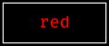
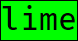

# Color

There are two `stacka` use cases where color is important:

1. Importing cell content: for example when setting `Box` content, and when
setting the glyphs, possibly colored, that make up the border and backdrop.

2. Styling boxes using the API: `border.setBg` for example, will set the
background color of the border, or the `boxes.labeled` widget which is
configured with a `labelBg`. These expect colors, not colored strings

The difference is that colors embedded in ANSI styled text do not have an
opacity value, and are assumed to be fully opaque. Once a color value has
entered `Stacka`, it always has an opacity.

## Importing Cell Content

Functions like [box.fromRow](../src/box/build.ts#L51), take ANSI styled strings
from the user. You can use any package to produce such strings. Every ANSI
attribute will be parsed into a `Style` type and attached to the correct cell of
the box grid.

This code, for example, uses the `Chalk` package to set colored box content:

```ts
import { boxes, box } from 'stacka';
import chalk from 'chalk';

const coloredText = chalk.red('red');

const bordered = boxes.line.of(content);

box.print(bordered);
```

Imported cells retain their ANSI styling, as you can see from the output of the
code above:



## API

Internally colors are encoded with an opacity channel. The key is called `a`,
but it is opacity and not an alpha channel: higher opacity means _more opaque_
(also: _less transparent_), exactly like CSS colors.

Opacity is used for the color [Blending](#blending) feature. The contribution of
a color to a blend operation is determined by its opacity. Cells with
`opacity=0` will not be visible at all. See the
[blends screenshot](screenshots/reference/blends.ts.png)
([source](../src/bin/reference/blends.ts)) for examples of how opacity
level determines blending level.

### Color Types

The [Color](../src/color/types.ts) type is a union of Rgba, Hwba, Hex, or CSS
named colors. See [Conversions](#conversions) below for info on converting
colors created using other libraries.

#### Rgba

This is the normalized internal color type. It is a numeric record with the
key/values:

1. `r | g | b`: range is 0-255
1. `a`: a number in the range 0-1, where 0 means transparent and 1 opaque

#### Hwba

A numeric record with the key/values:

1. `h`: is an angle given in degrees between 0 and 360
1. `w | b`: are percentage values within the range 0-100
1. `a`: a number in the range 0-1

#### Hex ≡ Hex<sub>3</sub> | Hex<sub>4</sub> | Hex<sub>6</sub> | Hex<sub>8</sub>

The `color.hex` constructor will safely build a color from a 3,4, 6, or
8 digit hexadecimal literal string. If no opacity is given, the opacity of
the color is set at 100% opaque.

```ts
import { color, hex } from 'stacka';

// the type of these values is `Color`
const red      = hex('#f00');    // implicitly opaque
const halfBlue = hex(#0000ff78); // opacity=½

// but these will raise compile time errors
const tooShort   = hex('#f0');
const tooLong    = hex('#123456789');
const noPrefix   = hex('ff0000');
const wrongDigit = hex('XYZ');
```

#### CSS Named Colors

You can use CSS names as colors. This is often the most convenient way.
For example:

```ts
import { color } from 'stacka';

const colored = color.bg('lime')('lime');

console.log(colored);
```

Will show:



### Building

[src/color/build.ts](../src/color/build.ts) defines constructors for `Rgba`
and `Hwba` from numeric tuples.

To safely create hex colors from literal strings use the `color.hex`
constructor with 3, 4, 6, or 8 digit hex values prefixed by a hash sign
(`#`).

Named colors are simply the color name, from the
[CSS named color list](https://developer.mozilla.org/en-US/docs/Web/CSS/named-color). 

For example, every value defined in the array `limeAllTheWayDown` below,
encodes the exact same color:

```ts
import { color, hex } from 'stacka';
import ansis from 'ansis';

// we use this to sample a color created by an external library
// (in this cases ansis), which does not expose the color value
//
// the only way to get at the color is by colorizing some text
// and parsing the ANSI escape sequence
//
// sample can be any string, even empty
const sample = ansis.hexBg('#0f0')('');

const limeAllTheWayDown: Color[] = [
 🟩 color.rgb( {r:   0, g: 255, b: 0}),       
 🟩 color.rgba({r:   0, g: 255, b: 0, a: 1}), 
 🟩 color.hwba({h: 120, w:   0, b: 0, a: 1}), 
 🟩 color.hex('#00ff00ff'),                   
 🟩 color.hex('#00ff00'),                     
 🟩 color.hex('#0f0f'),                       
 🟩 color.hex('#0f0'),                        
 🟩 'lime',
 🟩 color.fromAnsiBg(sample), // fromAnsiFg for the fg color
];
```

### Querying

### Modifying

### Blending

### Conversions

  In the [color](../src/color) module you will find functions for converting
  from the [Color](../src/color/types.ts) union type to Hwba or Rgba. This could
  be useful for some external color processing, for example:
  
```ts
import { box, color } from 'stacka';
import { black } from 'ansis/colors';

const myColor = color.hex('#b52');
const asHwba  = color.toHwba(myColor); // asHwba = { 
                                       //   h: 20,  
                                       //   w: 13,  
                                       //   b: 27,  
                                       //   a: 1 }   
const modded  = ... // manipulate colors, E.g. brighten

// we can now use the modded color, let us assume it is #b92
// 
// in this example it is used as the background color
// for a box with black text and no border
box.print(box({row: black`#b92`, gridBg: modded}));
```

Should show:


Note the box background showing through as the background of the box content,
because we have set no background color on the text.


To convert a color from some library, simply print an example string and parse
it into a color using the color parse functions. For example:

```ts
import { box, color } from 'stacka';
import { niceColor, colorize } from 'someNiceColorLibrary';

const sample = colorize(niceColor, 'sample');    // create sample
const myColor: Color = color.fromAnsiFg(sample); // also: fromAnsiBg

// ...now use color in stacka functions
```

Only the 1st color in the sample is extracted. This creates a single `Color`.
Using the `fromAnsi*` color constructors you can use your color library for all
`stacka` color use cases.

The information about the color source layer, foreground or background, is
erased. If you need both colors look into parsing the sample into a `Style` and
not a `Color`.

### See Also

Color packages used:

1. [Ansis](https://www.npmjs.com/package/ansis) - used internally for ANSI styling
   and for styling imported cell content in the `stacka` demos
2. [anser](https://www.npmjs.com/package/anser) - used for parsing ANSI strings
3. [color-name](https://www.npmjs.com/package/color-name) - colors from CSS color names
4. [color-convert](https://www.npmjs.com/package/color-convert) - color conversions
5. [color-blend](https://www.npmjs.com/package/color-blend) - blending of RGBA colors


