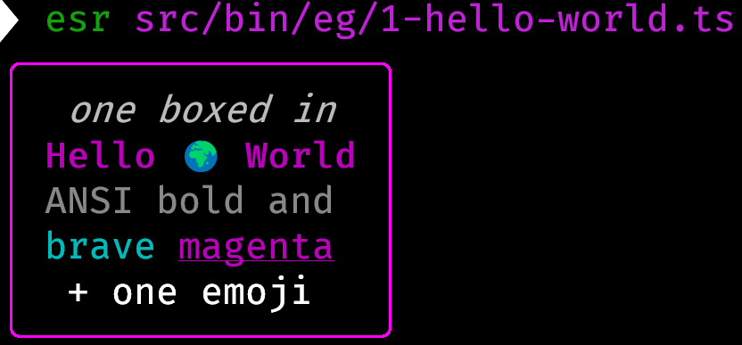
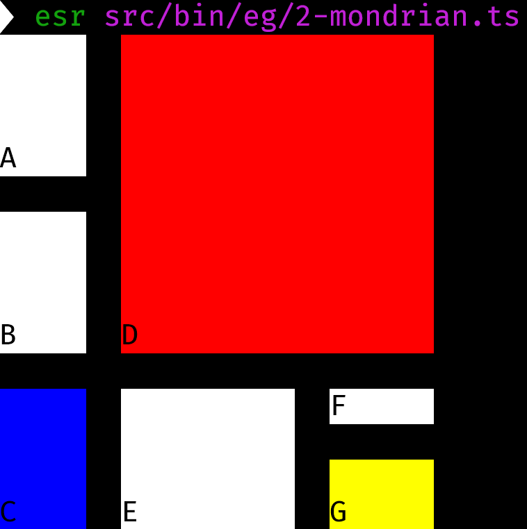
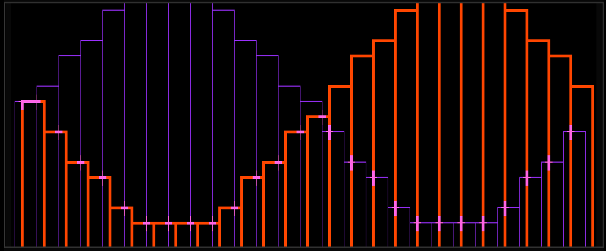
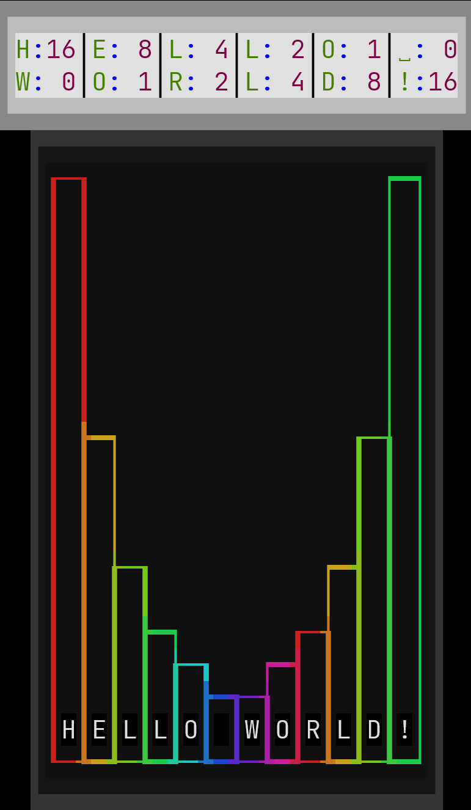
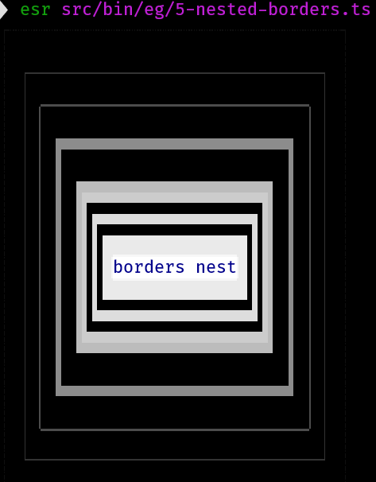
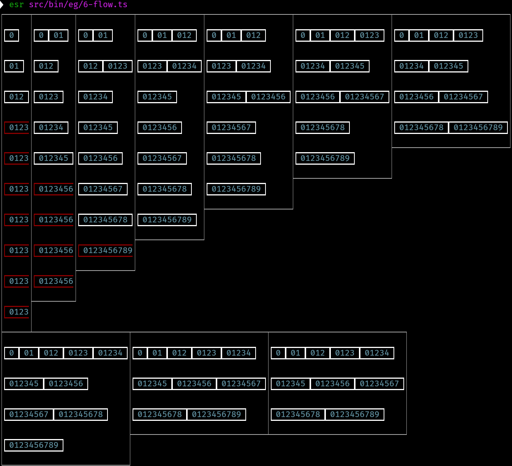
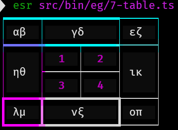
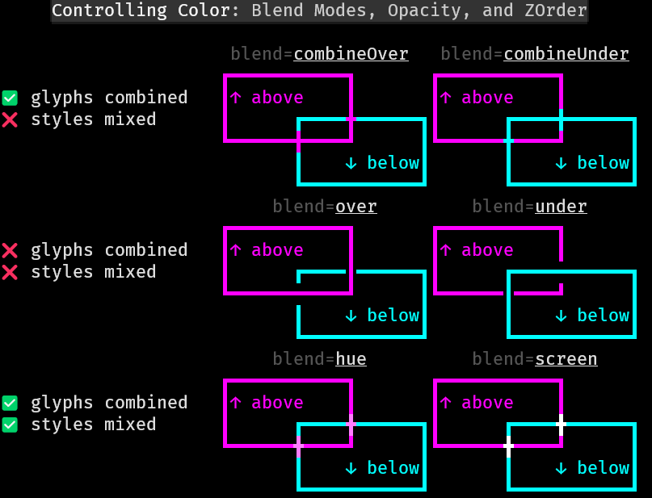
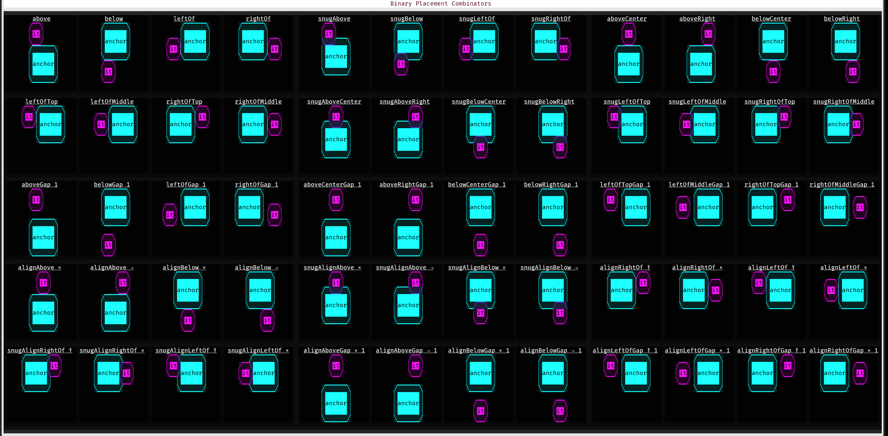
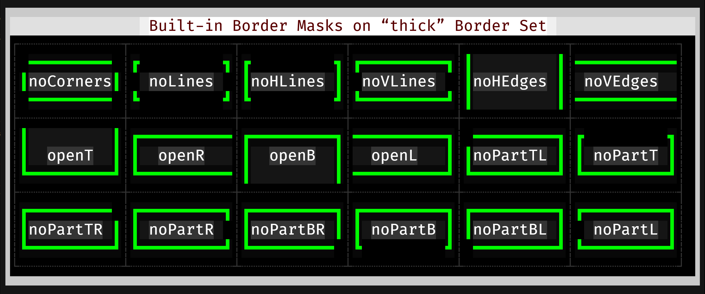

# Screenshot Gallery

1. Examples
    1. [1-hello-world.ts](../../src/bin/eg/1-hello-world.ts) 
    1. [2-mondrian.ts](../../src/bin/eg/2-mondrian.ts) 
    1. [3-waves.ts](../../src/bin/eg/3-waves.ts) also as [animation](eg/3-waves.ts.mkv) 
    1. [4-bar-chart.ts](../../src/bin/eg/4-bar-chart.ts) 
    1. [5-nested-borders.ts](../../src/bin/eg/5-nested-borders.ts) 
    1. [6-flow.ts](../../src/bin/eg/6-flow.ts) 
    1. [7-table.ts](../../src/bin/eg/7-table.ts) 
    1. [8-logo.ts](../../src/bin/eg/8-logo.ts) 
    1. [9-blend-modes.ts](../../src/bin/eg/9-blend-mode.ts) 

1. Reference
    1. [backdrops.ts](../../src/bin/reference/backdrops.ts) 
    1. [blends.ts](../../src/bin/reference/blends.ts) 
    1. [placements.ts](../../src/bin/reference/placements.ts) 
    1. Glyph
        1. [bitmaps.ts](reference/glyph/bitmaps.ts.png) 
        1. [next-glyph.ts](reference/glyph/next-glyph.ts.png) 
        1. [relations.ts](reference/glyph/relations.ts.png) 
    1. Border
        1. [masks.ts](reference/border/masks.ts.png) 
        1. [sets.ts](reference/border/sets.ts.png) 